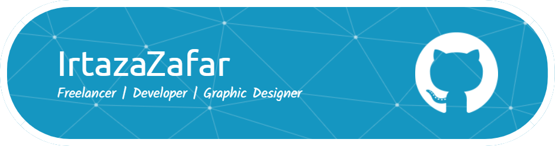

### I am **Irtaza Zafar** ***(Irtazafar)*** and have done Bachelor of Computer Science and still in learning phase. 

I have worked on following Programming Languages 

🔴 C++/C  
🔴 Java  
🔴 PHP  
🔴 C#  
🔴 Python (Learning Currently) 

I have following expertise in Graphic Designing 

🔵 Social Media Branding  
🔵 Instagram Templates  
🔵 Custom Templates  
🔵 Pinterest Pins and Ideas  
🔵 Instagram Stories/Reels  
🔵 Slides  
🔵 Website Prototype  
🔵 Brochure/Pamphlets/Poster/Flyer Design  

I have never dreamt about being successful, I worked it for it, and I’m still working to expand.
> ***Beauty gathers attention, while personality traps, captures the HEART***

****

Find out more about me & feel free to connect with me here:

## ⚡ Technologies

